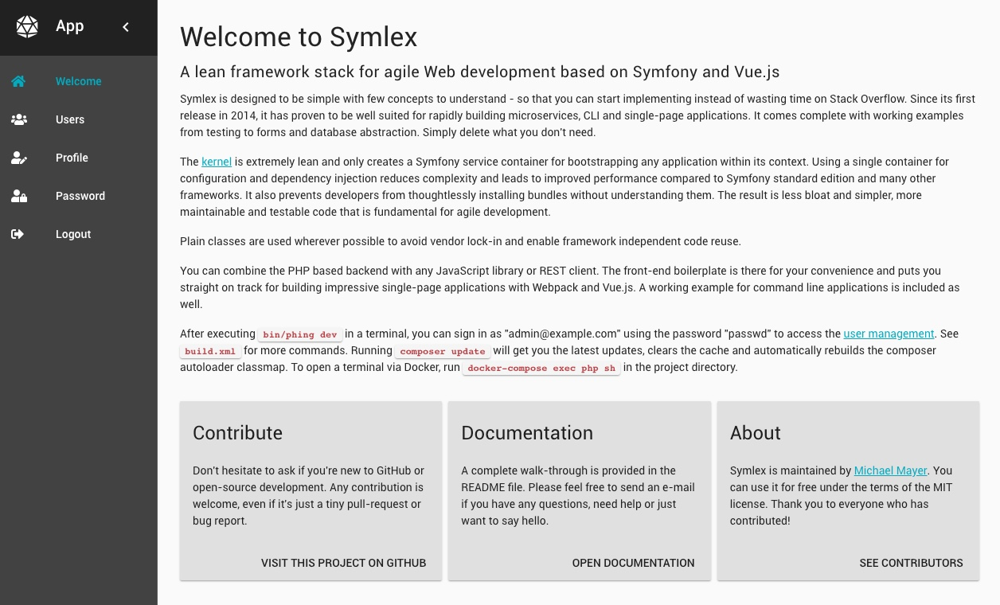
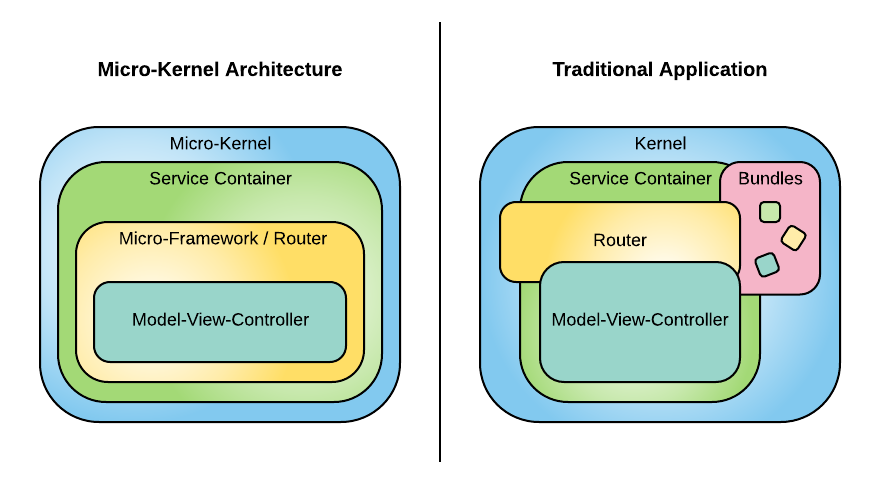
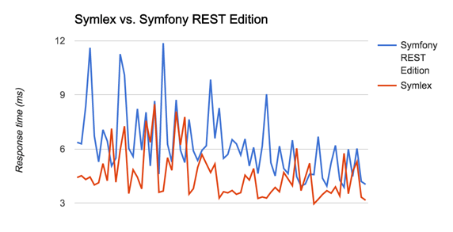

Symlex: A lean framework stack for agile Web development based on Symfony and Vue.js
====================================================================================

[](https://travis-ci.org/symlex/symlex)
[](https://packagist.org/packages/symlex/symlex)
[](https://packagist.org/packages/symlex/symlex)

Symlex is designed to be simple with few concepts to understand - so that you can start implementing instead 
of wasting time on Stack Overflow.
Since its first release in 2014, it has proven to be well suited for rapidly building microservices, 
CLI and single-page applications. It comes complete with working examples from testing to forms and database 
abstraction. Simply delete what you don't need.

The [kernel](https://github.com/symlex/di-microkernel) is extremely lean and only creates a Symfony 
service container for bootstrapping any application within its context.
Using a single container for configuration and dependency injection reduces complexity and leads to improved 
performance compared to Symfony standard edition and many other frameworks.
It also prevents developers from thoughtlessly installing bundles without understanding
them. The result is less bloat and simpler, more maintainable and testable code that is fundamental for agile development.
            
Plain classes are used wherever possible to avoid vendor lock-in and enable framework independent code reuse. See also [TRADEOFFS.md](TRADEOFFS.md).

You can combine the PHP based backend with any JavaScript library or REST client. The front-end boilerplate is there for 
your convenience and puts you straight on track for building impressive single-page applications with Webpack and Vue.js. 
A working example for command line applications is included as well.

**The goal of this project is to simplify agile Web development by providing a working system that promotes
best practices by example.**

*Note: https://github.com/symlex/symlex-core contains the bootstrap and routers as reusable components.*



Setup
-----
Before you start, make sure you got PHP 7, Composer and Docker installed on your system (short [howto](docs/OSX_HOWTO.md) 
for Mac OS X users). Instead of using Docker, you can also setup your own runtime environment based on the existing 
Docker configuration.

**Step 1:** Run [Composer](https://getcomposer.org/) to create a new Symlex project:

```
composer create-project symlex/symlex myapp
```

**Step 2:** Start nginx, PHP and MySQL using [Docker](https://www.docker.com/):

```
cd myapp
docker-compose up
```

*Note: This docker-compose configuration is for testing and development purposes only. On OS X, the current release of 
Docker is [really slow](https://twitter.com/lastzero/status/829191426391027712) in executing PHP from the host's file system.*

**Step 3:** Let [Phing](https://www.phing.info/) initialize the database and build the front-end components for you:

```
docker-compose exec php sh
bin/phing dev
```

*Note: You can also use this approach to execute other commands later (see `build.xml`). Alternatively, you can 
install npm and Yarn locally and link "db" to 127.0.0.1 in /etc/hosts to run them directly on your host.*

After successful installation, open the site at http://localhost:8081/ and log in as `admin@example.com` using the 
password `passwd`. If you add `localhost-debug` to your /etc/hosts and access the site with that, it will load in debug
mode (you'll see a stack trace and other debug information on the error pages).

The [mailhog](https://github.com/ian-kent/MailHog) user interface is available at http://localhost:8082/. It can be used
to receive and view mails automatically sent by the system, e.g. when new users are created.

About
-----
Symlex is maintained by [Michael Mayer](https://blog.liquidbytes.net/about) and
aims to simplify agile Web development by providing a working system 
that promotes best practices by example.
You can use it for free under the terms of the MIT license.
Thank you to everyone who has contributed!

Please feel free to send an e-mail if you have any questions, need help or just want to say hello. 
Contributions are welcome, even if it's just a tiny pull-request or bug report.

History
-------
Symlex was started in 2014 as a simple Silex boilerplate, since Silex itself doesn't come with a "Standard Edition" 
that points you in the right direction. Using Silex instead of Symfony was recommend by SensioLabs (the creators 
of both frameworks) as a light-weight alternative to Symfony + FOSRestBundle for quickly building high-performance 
REST services and single-page Web applications.

It was soon noticed that Pimple - the service container that comes with Silex - feels cumbersome for developers 
coming from Symfony and makes it hard to reuse existing code. In addition, many Silex code examples and even real-world 
applications accessed the service container from all parts of the code (not only the framework itself), 
which circumvents inversion of control and leads to awkward testability. Symlex therefore promotes the strict use of dependency 
injection and combines the convenience of a full-fledged service container with the speed of a micro-framework.

Today, Symlex has its own routing component (based on Symfony 4) and does not use Silex anymore. 
The framework has proven to be useful for a large number of different applications. Some of them were based on the regular
Symfony kernel before and did the change because they were drowning in complexity and suffered from response times well 
above 30 seconds in development mode. Symlex brought them back on track without big changes to their existing code base.



Bundles
-------
There is no support for bundles in Symlex. Using Symfony bundles often adds complexity to the overall architecture: 
They hide bootstrap/configuration details and encourage to build bloated applications. Symlex is designed to build 
focused, lean and fully testable applications. Writing meaningful component tests is not possible, if certain 
functionality is exclusively encoded in framework configuration files or magically generated by bundles 
(acceptance tests can be created, but they are slow and not suitable for test driven development or refactoring tasks).

See also: http://stackoverflow.com/questions/19064719/fosuserbundle-what-is-the-point

Key Features
------------
- Built on top of well documented and tested standard components
- Contains everything to create full-featured Web applications: Service container, REST routing & Twig template engine
- Strict use of dependency injection for configuration and bootstrapping
- Small code footprint
- High performance

Performance
-----------
It's obvious that PHP framework performance mainly depends on the lines of code that have to be executed for each request. While Symlex was designed to be simple and lean, a good performance certainly is an important by-product of this approach.

"The best code is no code. Where there is no code, there are no bugs. No API to learn. No awkward UI. The best refactors are deletions." -- [Eric Elliott](https://twitter.com/_ericelliott/status/671970774958272512)

Here is a benchmark, comparing the response time of Symlex and Symfony REST Edition for a GET request that returns a row from the database (Ubuntu 16.04 LTS with PHP 7.1 FPM, MySQL 5.7 and nginx; all optimizations on):



**Why should you care?** As a rule of thumb, **100 ms** is about the limit for having the user feel that the system is reacting instantaneously, meaning that no special feedback is necessary except to display the result (http://www.nngroup.com/articles/response-times-3-important-limits/). To be more precise, Wikipedia states that the perceptual processor cycle time has a range of 50 to 200 ms for a young adult (http://en.wikipedia.org/wiki/Usability). The total response time also includes network (about 25 ms for DSL), browser and other overhead, which only leaves a small fraction of those 100 ms for implementing the actual business logic.

Configuration
-------------
YAML files located in `app/config/` configure the entire system based on parameter and service definitions. The filename matches the application's environment name:
- `app/config/web.yml` configures Web (HTTP) applications bootstrapped in `web/app.php`
- `app/config/console.yml` configures command-line applications bootstrapped in `app/console`

These files are in the same format you know from Symfony. In addition to the regular services, they also contain the actual application as a service ("app"):

    services:
        app:
            class: Symlex\Application\Web
            public: true

This provides a uniform approach for bootstrapping Web (`Symlex\Application\Web`) and command-line (`Symfony\Component\Console\Application`) applications with the same kernel.

*Note: If debug mode is turned off, the service container is cached in storage/cache/. You have to run `app/clearcache` after updating the configuration. To disable caching completely, add `container.cache: false` to  `app/config/parameters.yml`*

Bootstrapping
-------------
Bootstrapping is performed using a [micro-kernel](https://github.com/symlex/di-microkernel). It's just a few lines to 
set environment parameters, initialize the Symfony service container and run the app:

```php
<?php

namespace DIMicroKernel;

class Kernel
{
    protected $environment;
    protected $debug;
    protected $appPath;

    public function __construct($environment = 'app', $appPath = '', $debug = false)
    {
        $this->environment = $environment;
        $this->debug = $debug;
        $this->appPath = $appPath;

        $this->boot();
    }
    
    ...
    
    public function getApplication()
    {
        return $this->getContainer()->get('app');
    }
    
    public function run()
    {
        return $this->getApplication()->run();
    }
}
```

The kernel base class can be extended to customize it for a specific purpose (e.g. command line application):

```php
<?php
namespace App\Kernel;

use DIMicroKernel\Kernel;

class ConsoleApp extends Kernel
{
    public function __construct($appPath, $debug = false)
    {
        parent::__construct('console', $appPath, $debug);
    }

    public function setUp()
    {
        chdir($this->getAppPath());
        set_time_limit(0);
        ini_set('memory_limit', '-1');
    }
}
```

Creating a kernel instance and calling `run()` is enough to start any application (see `app/console` and `web/app.php`):

```php
#!/usr/bin/env php
<?php

require_once __DIR__ . '/../vendor/autoload.php';

use App\Kernel\ConsoleApp;
$app = new ConsoleApp (__DIR__);
$app->run();
```

Command-Line Interface
----------------------
Running `app/console` lists all commands available. The following commands including **Doctrine Migrations** 
for creating and migrating database tables are supported out of the box:

Command                  | Description
-------------------------|----------------------------------------------------------------------------
migrations:execute       | Execute a single migration version up or down manually
migrations:generate      | Generate a blank migration class
migrations:migrate       | Execute a migration to a specified version or the latest available version
migrations:status        | View the status of a set of migrations
migrations:version       | Manually add and delete migration versions from the version table
database:create          | Create the database configured in app/config/parameters.yml
database:drop            | Drop the database configured in app/config/parameters.yml
database:insert-fixtures | Insert database fixtures for testing (see app/db/fixtures/)
user:create              | Create a new user
user:delete              | Delete a user
user:reset-password      | Send password reset email to a user

Routing and Rendering
---------------------
Matching requests to controller actions is performed based on convention instead of extensive configuration. There are three router classes included in the core library. They configure the Symfony router component to perform the actual routing, so you can expect the same high performance. After routing a request to the appropriate controller action, the router subsequently renders the response to ease controller testing (actions never directly return JSON or HTML):

- `Symlex\Router\Web\RestRouter` handles REST requests (JSON)
- `Symlex\Router\Web\ErrorRouter` renders exceptions as error messages (HTML or JSON)
- `Symlex\Router\Web\TwigRouter` renders regular Web pages via Twig (HTML)
- `Symlex\Router\Web\TwigDefaultRouter` is like TwigRouter but sends all requests to a default controller action (required for client-side routing e.g. with Vue.js)

It's easy to create your own custom routing/rendering based on the existing examples.

The application's HTTP kernel class initializes routing and sets optional URL/service name prefixes:
```php
<?php

namespace App\Kernel;

use DIMicroKernel\Kernel;

class WebApp extends Kernel
{
    public function __construct($appPath, $debug = false)
    {
        parent::__construct('web', $appPath, $debug);
    }

    public function init()
    {
        if ($this->debug) {
            ini_set('display_errors', 1);
        }
    }
    
    protected function setUp()
    {
        $container = $this->getContainer();

        // The error router catches errors and displays them as error pages
        $container->get('router.error')->route();

        // Routing for REST API calls
        $container->get('router.rest')->route($this->getUrlPrefix('/api/v1'), 'controller.rest.v1.');

        // All other requests are routed to a default controller action (client-side routing e.g. with Vue.js)
        $container->get('router.twig_default')->route($this->getUrlPrefix(), 'controller.web.index', 'index');

        // Uncomment the following line to enable server-side routing
        // $container->get('router.twig')->route($this->getUrlPrefix(), 'controller.web.');
    }
}
```

Routing examples based on the default configuration in `App\Kernel\WebApp`:
- All request (except those starting with `/api/v1`) will be routed to `controller.web.index` service's `indexAction(Request $request)`
- `GET /api/v1/users` will be routed to `controller.rest.v1.users` service's `cgetAction(Request $request)`
- `POST /api/v1/users` will be routed to `controller.rest.v1.users` service's `postAction(Request $request)`
- `OPTIONS /api/v1/users` will be routed to `controller.rest.v1.users` service's `coptionsAction(Request $request)`
- `GET /api/v1/users/123` will be routed to `controller.rest.v1.users` service's `getAction($id, Request $request)`
- `OPTIONS /api/v1/users/123` will be routed to `controller.rest.v1.users` service's `optionsAction($id, Request $request)`
- `GET /api/v1/users/123/comments` will be routed to `controller.rest.v1.users` service's `cgetCommentsAction($id, Request $request)`
- `GET /api/v1/users/123/comments/5` will be routed to `controller.rest.v1.users` service's `getCommentsAction($id, $commendId, Request $request)`
- `PUT /api/v1/users/123/comments/5` will be routed to `controller.rest.v1.users` service's `putCommentsAction($id, $commendId, Request $request)`

If you uncomment the `router.twig` router in exchange for `router.twig_default`, requests (except those starting with `/api/v1`) 
will be routed to matching web controller actions e.g.:
- `GET /` will be routed to `controller.web.index` service's `indexAction(Request $request)`
- `GET /foo` will be routed to `controller.web.foo` service's `indexAction(Request $request)`
- `GET /foo/bar` will be routed to `controller.web.foo` service's `barAction(Request $request)`
- `POST /foo/bar` will be routed to `controller.web.foo` service's `postBarAction(Request $request)`

Controllers
-----------
Symlex controllers are plain PHP classes by default. They have to be added as service to `app/config/web.yml` (Twig) or `app/config/rest.yml` (REST):

```yaml
controller.rest.v1.users:
    class: App\Controller\Rest\V1\UsersController
    public: true
    arguments: [ "@service.session", "@model.factory", "@form.factory" ]
    calls:
        - [ setMailService, [ "@service.mail" ]]
```

*Note: In Symfony and many other frameworks, controllers aren't services by default. Some developers are used to give 
controllers direct access to the service container instead of using dependency injection, which makes testing more 
difficult and leads to less portable code (framework lock-in).*

The routers pass on the request instance to each matched controller action as last argument. It contains request parameters and headers: http://symfony.com/doc/current/book/http_fundamentals.html#requests-and-responses-in-symfony

**Web controller actions** can either return nothing (the matching Twig template will be rendered), an array (the Twig template can access the values as variables) or a string (redirect URL). Twig's template base directory can be configured in `app/config/twig.yml` (`twig.path`). The template filename is matching the request route: `[twig.path]/[controller]/[action].twig`. If no controller or action name is given, `index` is the default (the response to `/` is therefore rendered using `index/index.twig`).

Example: [IndexController](https://github.com/symlex/symlex/blob/master/src/Controller/Web/IndexController.php)

REST
----
Symlex REST controllers use a naming scheme similar to FOSRestBundle's "implicit resource name definition". The action name is derived from the request method and optional sub resources:

```php
<?php

class UsersController
{
    ..

    public function cgetAction(Request $request)
    {} // [GET] /users

    public function coptionsAction(Request $request)
    {} // [OPTIONS] /users
    
    public function postAction(Request $request)
    {} // [POST] /users

    public function getAction($id, Request $request)
    {} // [GET] /users/{id}
    
    public function optionsAction($id, Request $request)
    {} // [OPTIONS] /users/{id}

    ..
    public function cgetCommentsAction($id, Request $request)
    {} // [GET] /users/{id}/comments
    
    public function getCommentsAction($id, $commentId, Request $request)
    {} // [GET] /users/{id}/comments/{commentId}

    ..
}
```

**REST controller actions** always return arrays, which are automatically converted to valid JSON. Delete actions can return *null* ("204 No Content").

Examples: 
- [UsersController](https://github.com/symlex/symlex/blob/master/src/Controller/Rest/V1/UsersController.php)
- [SessionController](https://github.com/symlex/symlex/blob/master/src/Controller/Rest/V1/SessionController.php)
- [RegistrationController](https://github.com/symlex/symlex/blob/master/src/Controller/Rest/V1/RegistrationController.php)

Models, Forms & Databases
-------------------------
Symlex isn't designed for any specific database abstraction layer or model library. The examples are based on MySQL 
and [Doctrine ActiveRecord](https://github.com/symlex/doctrine-active-record). It is a lot faster and less complex 
than Datamapper ORM implementations.

The [InputValidation](https://github.com/symlex/input-validation) package provides secure whitelist validation 
for validating user input data in the controller layer before passing it to models.

The following example shows how to work with those libraries in a REST controller context. Note, how easy it is 
to avoid deeply nested structures. User model and form factory are injected as dependencies.

```php
namespace App\Controller\Rest;

use Symfony\Component\HttpFoundation\Request;
use App\Exception\FormInvalidException;
use App\Form\FormFactory;
use App\Model\User;

class UsersController
{
    protected $user;
    protected $formFactory;

    public function __construct(User $user, FormFactory $formFactory)
    {
        $this->user = $user;
        $this->formFactory = $formFactory;
    }
    
    public function cgetAction(Request $request)
    {
        $options = array(
            'count' => $request->query->get('count', 50),
            'offset' => $request->query->get('offset', 0)
        );
        
        return $this->user->search(array(), $options);
    }

    public function getAction($id)
    {
        return $this->user->find($id)->getValues();
    }

    public function deleteAction($id)
    {
        return $this->user->find($id)->delete();
    }

    public function putAction($id, Request $request)
    {
        $this->user->find($id);
        
        $form = $this->formFactory->create('User\Edit');
        $form->setDefinedWritableValues($request->request->all())->validate();

        if($form->hasErrors()) {
            throw new FormInvalidException($form->getFirstError());
        } 
        
        $this->user->update($form->getValues());

        return $this->user->getValues();
    }

    public function postAction(Request $request)
    {
        $form = $this->formFactory->create('User\Create');
        $form->setDefinedWritableValues($request->request->all())->validate();

        if($form->hasErrors()) {
            throw new FormInvalidException($form->getFirstError());
        }
        
        $this->user->save($form->getValues());

        return $this->user->getValues();
    }
}
```

Error Handling
--------------
Exceptions are automatically catched by the application and then passed on to ErrorRouter, which either renders an HTML error page or returns the error details as JSON (depending on the request headers). Exception class names are mapped to error codes in `app/config/exceptions.yml`:

```yaml
parameters:
    exception.codes:
        InvalidArgumentException: 400
        App\Exception\UnauthorizedException: 401
        App\Exception\AccessDeniedException: 403
        App\Exception\FormInvalidException: 409
        Exception: 500

    exception.messages:
        400: 'Bad request'
        401: 'Unauthorized'
        403: 'Forbidden'
        404: 'Not Found'
        405: 'Method Not Allowed'
        500: 'Looks like something went wrong!'

services:
    router.error:
        class: Symlex\Router\Web\ErrorRouter
        public: true
        arguments: [ "@app", "@twig", "%exception.codes%", "%exception.messages%", "%app.debug%" ]
```

The filename for Twig error templates is `app/templates/error/[code].twig`. If no template is found, the default template (`default.twig`) is used.

Unit Tests
----------
Symlex comes with a pre-configured PHPUnit environment that automatically executes tests found in `src/`:

    /var/www/html# bin/phpunit
    PHPUnit 6.5.11 by Sebastian Bergmann and contributors.
    
    ...............................................                   47 / 47 (100%)
    
    Time: 3.12 seconds, Memory: 12.00MB
    
    OK (47 tests, 145 assertions)
    
See also [TestTools - Adds a service container and self-initializing fakes to PHPUnit](https://github.com/lastzero/test-tools)

Acceptance Tests
----------------
A ready-to-use [Codeception](https://codeception.com/) test suite for acceptance tests is located in `app/codeception/`:

    /var/www/html# bin/codecept run
    Codeception PHP Testing Framework v2.4.5
    Powered by PHPUnit 6.5.11 by Sebastian Bergmann and contributors.
    
    Acceptance Tests (1) -------------------
    ✔ HomeCest: Open homepage (0.36s)
    ----------------------------------------
    
    Time: 6.31 seconds, Memory: 10.00MB
    
    OK (1 test, 1 assertion)

Codeception's main config file is `codeception.yml` in the project directory.
